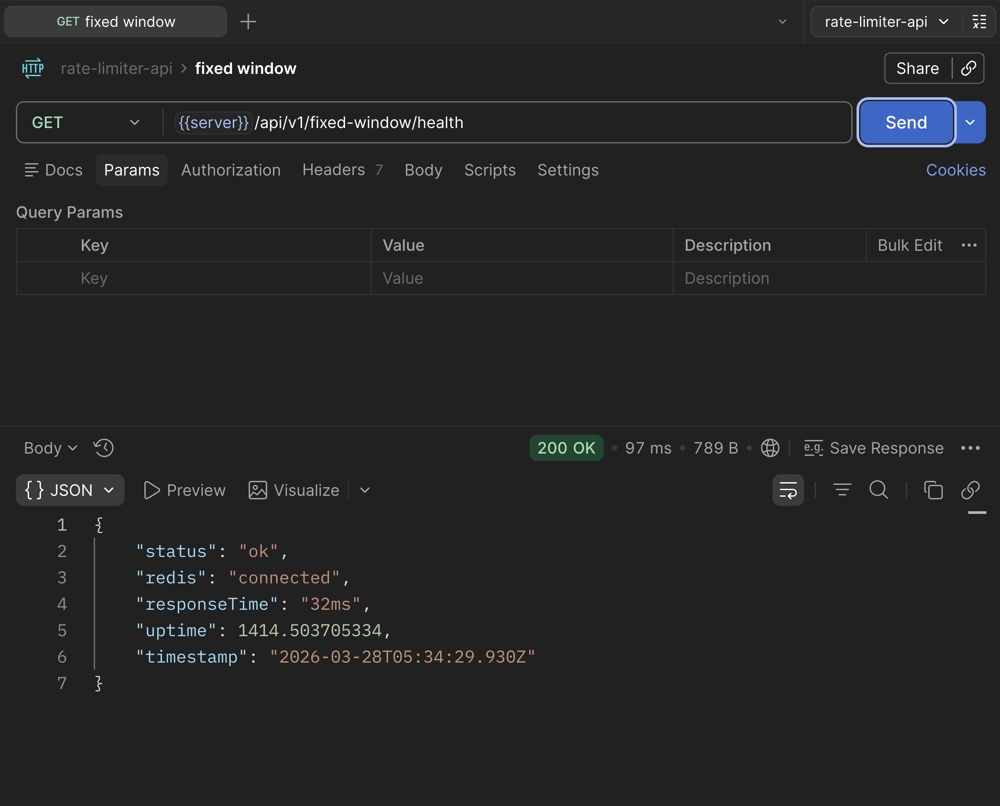
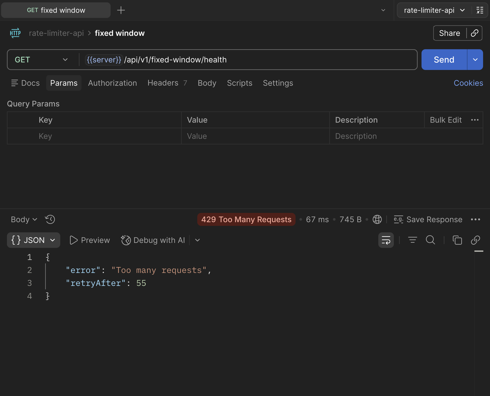
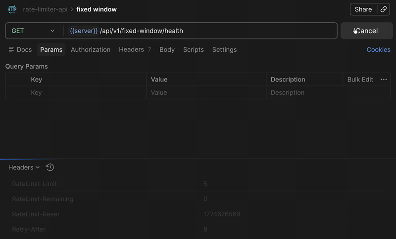
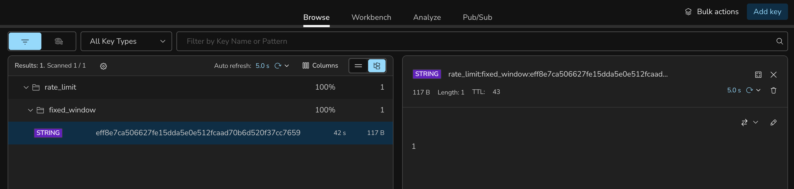

# Rate Limiter API (Node.js + Redis)

## Overview

A backend system implementing *rate limiting* using **Redis**.
This project demonstrates how different algorithms control request flow under load, with a focus on scalability and performance.

---

## Tech Stack


---

## Features

* Fixed Window rate limiting (implemented)
* Redis-backed request tracking
* IP-based client identification
* Middleware-driven architecture
* Extensible design for additional algorithms

---

## Fixed Window Rate Limiting

### Flow

```
Client Request → Middleware → Redis Counter → Allow / Block (429)
```

---

### Implementation

* Middleware: [fixedWindow.js](./src/middlewares/fixedWindow.js)
* Service: [fixedWindow.service.js](./src/services/fixedWindow.service.js)
* Routes: [api.js](./src/routes/api.js)

---

### Redis Key Design

```
rate_limit:fixed_window:<hashed_ip>
```

---

### Endpoint

```
GET /api/v1/fixed-window/health
```

---

### Behavior

#### Allowed (200 OK)



#### Rate Limited (429)



#### Headers



#### Redis State (TTL + Counter)

TTL is set on first request and automatically resets the counter after the window expires.



---

### Quick Test

```
for i in {1..20}; do curl http://localhost:3000/api/v1/fixed-window/health & done
```

---

### Limitations

* Burst requests at window boundaries
* Not suitable for high-precision rate control

---

## Upcoming Algorithms

### Sliding Window Counter

* Reduces burst issues using weighted windows
* Planned:

  * `src/middlewares/slidingWindowLimiter.js`
  * `src/services/slidingWindow.service.js`

---

### Token Bucket

* Controls rate using token refill mechanism
* Planned:

  * `src/middlewares/tokenBucketLimiter.js`
  * `src/services/tokenBucket.service.js`

---

## Project Structure

```
assets/
  v1/fixed-window/

src/
  config/
  middlewares/
  routes/
  services/
  utils/
```

---

## Roadmap

* Implement Sliding Window Counter
* Implement Token Bucket
* Introduce Redis Lua scripts for atomic operations
* Add user-based rate limiting
* Improve observability and logging
